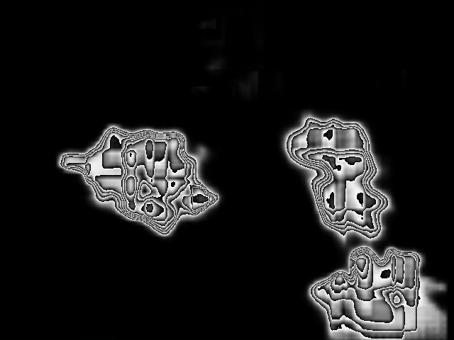

# Pollination project: Segmentation using MASK-RCNN

## Requirements:

- Python >= 3.5
- Pytorch >= 1.1

## Dataset Type:

Our dataset is made of RGB image and the corresponding binary mask; we automatically generate 2D bounding boxes
from the binary mask to be able to use mask-RCNN.

## Training the network

To train the network make sure that your training data is organized in
path/to/data/img for images and path/to/data/mask for binary masks

Run the following command: 

-  python train.py --p path/to/data/

## Results with the network trained for 10 epochs

To test the network run the following command:

- python test.py --p path_to_test_image

Example of result:

