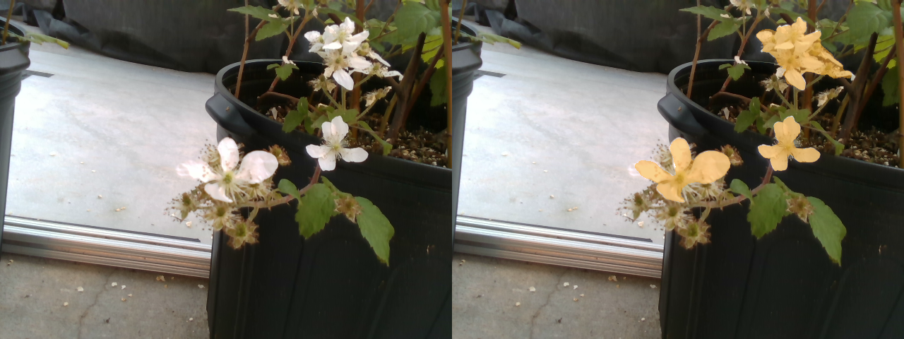

# Pollination project: Segmentation using [Mask-RCNN](https://arxiv.org/pdf/1703.06870.pdf)

## Requirements:

- Python >= 3.5
- [Pytorch](https://github.com/pytorch/pytorch) >= 1.1

## Dataset Type:

Our dataset is made of RGB image and the corresponding binary mask; we automatically generate 2D bounding boxes
from the binary mask to be able to use mask-RCNN.

## Training the network

To train the network make sure that your training data is organized in
path/to/data/img for images and path/to/data/mask for binary masks

Run the following command: 

-  python train.py --p path/to/data/

## Results with the network trained for 10 epochs

Download the weights [here](https://drive.google.com/file/d/1K3-7pavCZWxGNvUPTnLAjY76JKLnzLlN/view?usp=sharing
):

And run the following command:

- python test.py --p path/to/test/image --w path/to/weights

Example of result:

